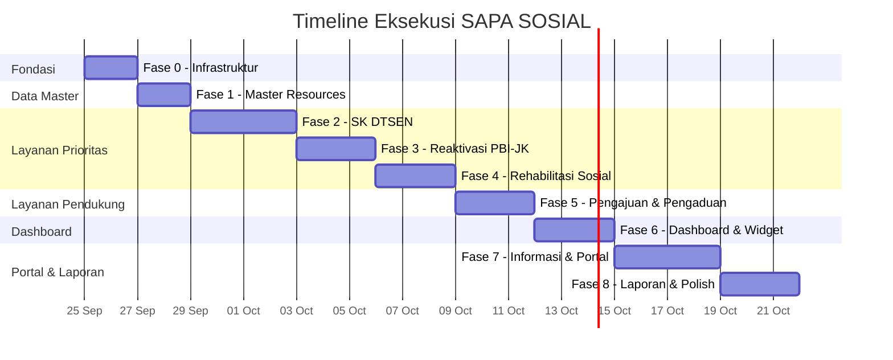

# Rencana Aksi — Dashboard SAPA SOSIAL (Filament v5)

> **Proyek:** SAPA SOSIAL — Satu Pintu Layanan Sosial Kabupaten Blitar
> **Stack:** Laravel 13 · Filament v5.8 · Livewire v4 · Tailwind CSS v4 · PostgreSQL
> **Status saat ini:** 31 Model, 13 Enum, 34 Migrasi, Seeder lengkap — **belum ada Filament Resource/Widget/Page**

---

## Fase 0 — Fondasi & Infrastruktur

| # | Task | Detail | Output |
|---|------|--------|--------|
| 0.1 | Install paket pendukung | `spatie/laravel-permission`, `spatie/laravel-activitylog`, `barryvdh/laravel-dompdf` (atau `spatie/laravel-pdf`), `simplesoftwareio/simple-qrcode`, paket ekspor Excel (Filament Export Action / `maatwebsite/excel`) | `composer.json` updated |
| 0.2 | Publish & konfigurasi spatie/laravel-permission | Jalankan migrasi permission, sesuaikan config untuk PostgreSQL | Tabel `roles`, `permissions`, dll. |
| 0.3 | Publish & konfigurasi spatie/laravel-activitylog | Config `activity_log` table — pastikan tidak bentrok dengan migrasi `000031` yang sudah ada | Audit log aktif |
| 0.4 | Buat Enum `Role` | `Admin`, `PetugasDinsos`, `PejabatPenandatangan`, `Pimpinan`, `OperatorKecamatan`, `Masyarakat` | [`app/Enums/Role.php`](file:///c:/laragon/www/app-layanan/app/Enums/Role.php) |
| 0.5 | Trait `HasRoles` di User model | Integrasikan `spatie/laravel-permission` ke [`User.php`](file:///c:/laragon/www/app-layanan/app/Models/User.php), tambahkan helper `isAdmin()`, `isPetugas()`, dll. | Model User enhanced |
| 0.6 | Seeder role & permission | Buat `RolePermissionSeeder` — definisikan semua role + permission per modul | Seeder executable |
| 0.7 | Setup PostgreSQL database | Pastikan `.env` mengarah ke PostgreSQL, jalankan `php artisan migrate:fresh --seed` | Database siap |
| 0.8 | Konfigurasi AdminPanelProvider | Tambahkan navigasi groups, branding, SPA mode, bahasa Indonesia, dan konfigurasi `navigation()` | Panel admin terkonfigurasi |

---

## Fase 1 — Data Master (Resources CRUD Sederhana)

> Resources CRUD standar untuk tabel referensi/master yang dikelola admin.

| # | Resource | Model | Fitur Utama |
|---|----------|-------|-------------|
| 1.1 | `WorkUnitResource` | [`WorkUnit`](file:///c:/laragon/www/app-layanan/app/Models/WorkUnit.php) | CRUD, toggle `is_active` |
| 1.2 | `DistrictResource` | [`District`](file:///c:/laragon/www/app-layanan/app/Models/District.php) | CRUD, relasi ke villages |
| 1.3 | `VillageResource` | [`Village`](file:///c:/laragon/www/app-layanan/app/Models/Village.php) | CRUD, filter by district |
| 1.4 | `ServiceTypeResource` | [`ServiceType`](file:///c:/laragon/www/app-layanan/app/Models/ServiceType.php) | CRUD, manage `service_requirements` (HasMany), toggle `is_active`, field `handler` |
| 1.5 | `DtsenPurposeResource` | [`DtsenPurpose`](file:///c:/laragon/www/app-layanan/app/Models/DtsenPurpose.php) | CRUD, `max_decile`, `validity_days` |
| 1.6 | `ClientCategoryResource` | [`ClientCategory`](file:///c:/laragon/www/app-layanan/app/Models/ClientCategory.php) | CRUD simple |
| 1.7 | `ComplaintCategoryResource` | [`ComplaintCategory`](file:///c:/laragon/www/app-layanan/app/Models/ComplaintCategory.php) | CRUD, toggle `is_active` |
| 1.8 | `ReferralInstitutionResource` | [`ReferralInstitution`](file:///c:/laragon/www/app-layanan/app/Models/ReferralInstitution.php) | CRUD, toggle `is_active` |
| 1.9 | `UserResource` | [`User`](file:///c:/laragon/www/app-layanan/app/Models/User.php) | CRUD, assign roles, filter by role/unit kerja, toggle `is_active` |

> **Navigasi group:** "Master Data" — hanya tampil untuk role `Admin`

---

## Fase 2 — Layanan 1: Surat Keterangan DTSEN ⭐

| # | Task | Detail |
|---|------|--------|
| 2.1 | `ServiceRequestResource` (shared) | Resource utama pengajuan layanan — table list dengan filter `service_type`, `status`, `village`, `is_priority`; kolom: `request_number`, `applicant_name`, `service_type.name`, status badge, `submitted_at`, officer |
| 2.2 | Form Create/Edit `ServiceRequest` | Form dinamis berdasarkan `service_type.handler`: field umum (identitas pemohon, village select, dokumen) + field khusus DTSEN (orang yang diterangkan, tujuan penggunaan) |
| 2.3 | `DtsenCertificateResource` (atau RelationManager) | Manage detail SK DTSEN di dalam ServiceRequest: input cek SIKS-NG (`is_registered`, `decile`, `checked_at`, `checker_id`), generate draf surat |
| 2.4 | Action: Pemeriksaan Berkas | Filament Table Action — petugas verifikasi dokumen, set `verification_status` per dokumen, transisi status ke `document_check` / `revision_requested` |
| 2.5 | Action: Verifikasi Data SIKS-NG | Form action — isi hasil cek SIKS-NG; validasi desil ≤ `dtsen_purposes.max_decile`; transisi ke `data_verification` → `awaiting_approval` |
| 2.6 | Action: Paraf & Persetujuan Berjenjang | Step 1: Kabid paraf → Step 2: Kadis tanda tangan; buat record `approvals`; transisi `awaiting_approval` → `issued` |
| 2.7 | Action: Terbitkan SK DTSEN | Generate `certificate_number` (via `NumberSequence`), generate PDF dengan QR code (`verification_code`), simpan file, set `issued_at`, `valid_until` |
| 2.8 | Action: Tolak Pengajuan | Form alasan penolakan, transisi ke `rejected` |
| 2.9 | Trait `RecordsStatusHistory` | Trait pada model — otomatis catat ke `status_histories` setiap kali status berubah; dipakai oleh `ServiceRequest`, `Complaint`, `RehabilitationCase`, `Referral` |
| 2.10 | Duplikasi Warning | Peringatan saat pemohon + tujuan sama dan surat masih berlaku |
| 2.11 | Policy `ServiceRequestPolicy` | Atur akses: Admin full, Petugas CRUD, Operator wilayahnya, Pimpinan view-only, Masyarakat hanya miliknya |

---

## Fase 3 — Layanan 2: Reaktivasi KIS / PBI-JK ⭐

| # | Task | Detail |
|---|------|--------|
| 3.1 | Extend `ServiceRequestResource` | Tambah handler `pbi` — field khusus: `participant_nik`, `bpjs_card_number`, `deactivated_date`, `reason`, `health_facility_name`, `health_letter_number` |
| 3.2 | `PbiReactivationResource` (atau RelationManager) | Manage detail reaktivasi PBI-JK di dalam ServiceRequest |
| 3.3 | Action: Verifikasi Kelayakan | Cek desil, status SIKS-NG/DTSEN; transisi `eligibility_verification` → `awaiting_approval` |
| 3.4 | Action: Terbitkan Surat Rekomendasi | Generate `recommendation_number`, file PDF; transisi `awaiting_approval` → `recommendation_issued` |
| 3.5 | Action: Usulkan ke SIKS-NG | Catat `proposed_to_ministry_at`; transisi → `proposed_to_ministry` |
| 3.6 | Action: Catat Keputusan Kemensos | Input `ministry_decision`, `ministry_decided_at`; transisi → `ministry_approved` / `ministry_rejected` |
| 3.7 | Action: Catat Kepesertaan Aktif Kembali | Input `reactivated_date`; transisi → `reactivated` → `completed` |
| 3.8 | Prioritas darurat medis | Flag `is_priority` otomatis jika `reason = emergency`; sort di table |
| 3.9 | Alert tiket tertahan | Tandai pengajuan di `proposed_to_ministry` > X hari (configurable) |

---

## Fase 4 — Layanan 3: Rehabilitasi Sosial ⭐

| # | Task | Detail |
|---|------|--------|
| 4.1 | `ClientResource` | CRUD klien rehabilitasi — data sensitif, akses terbatas |
| 4.2 | `RehabilitationCaseResource` | List kasus aktif, filter by status/officer/category; kolom: `case_number`, client info, status badge, `received_at` |
| 4.3 | RelationManager: `AssessmentsRelationManager` | CRUD assessment dalam kasus — validasi wajib sebelum rencana pelayanan |
| 4.4 | RelationManager: `ReferralsRelationManager` | CRUD rujukan — hanya bisa dibuat jika `assessment.needs_referral = true`; nomor rujukan via `NumberSequence` |
| 4.5 | RelationManager: `MonitoringRecordsRelationManager` | CRUD monitoring — wajib tanggal, petugas, progress, catatan |
| 4.6 | Action: Transisi Status Kasus | `received` → `assessment` → `service_planning` → `in_service` → `monitoring` → `closed`; validasi per transisi |
| 4.7 | Action: Tutup Kasus | Validasi `handling_result` wajib diisi dan monitoring terakhir tercatat |
| 4.8 | Policy `RehabilitationCasePolicy` | Hanya petugas yang ditugaskan + admin + pimpinan (summary) |

---

## Fase 5 — Layanan 4 & 5: Pengajuan Lain & Pengaduan

| # | Task | Detail |
|---|------|--------|
| 5.1 | Extend `ServiceRequestResource` handler `generic` | Form pengajuan umum — persyaratan dinamis dari `service_requirements` |
| 5.2 | `ComplaintResource` | CRUD pengaduan — form: kategori, lokasi, deskripsi, lampiran; table list dengan filter status/category/village |
| 5.3 | RelationManager: `ComplaintAttachmentsRelationManager` | Upload foto/dokumen |
| 5.4 | Action: Verifikasi & Klarifikasi | Petugas verifikasi, minta klarifikasi; transisi `received` → `verification` → `dispatched` |
| 5.5 | Action: Disposisi | Buat record `dispositions` — assign ke unit kerja/petugas |
| 5.6 | Action: Penanganan & Selesai | Input `action_taken`; transisi → `in_handling` → `resolved` |
| 5.7 | Action: Tandai Duplikat | Link ke `duplicate_of_id`; status → `duplicate` |
| 5.8 | Action: Link ke Kasus Rehsos | Buat `RehabilitationCase` dari pengaduan |
| 5.9 | Policy `ComplaintPolicy` | Akses sesuai role & wilayah |

---

## Fase 6 — Dashboard & Widget (Bagian 3 PRD)

> Widget Filament v5 di halaman Dashboard — filter: periode, jenis layanan, status, kecamatan, desa.

| # | Widget | Tipe | Data |
|---|--------|------|------|
| 6.1 | `DtsenIssuedOverview` | `StatsOverviewWidget` | Jumlah SK DTSEN terbit per periode, per tujuan & per desil |
| 6.2 | `DtsenAwaitingSignature` | `StatsOverviewWidget` | Antrean draf menunggu paraf/persetujuan |
| 6.3 | `PbiReactivationByStage` | `StatsOverviewWidget` | Jumlah per status: verifikasi, Kemensos, aktif kembali, ditolak |
| 6.4 | `PbiOverdueAlert` | `TableWidget` | Pengajuan PBI tertahan melebihi batas hari |
| 6.5 | `PbiEmergencyQueue` | `TableWidget` | Pengajuan darurat medis belum selesai |
| 6.6 | `ActiveRehabCases` | `StatsOverviewWidget` | Kasus aktif: assessment, pelayanan, monitoring; rujukan per lembaga |
| 6.7 | `IncomingRequestsChart` | `ChartWidget` | Pengajuan & pengaduan masuk per periode, per jenis/kategori |
| 6.8 | `ProcessingVsCompleted` | `StatsOverviewWidget` | Tiket belum selesai vs selesai per status |
| 6.9 | `RegionalDistribution` | `ChartWidget` / `TableWidget` | Sebaran layanan & pengaduan per kecamatan/desa |
| 6.10 | `MostAccessedInfo` *(opsional)* | `TableWidget` | Konten informasi paling sering diakses |
| 6.11 | Dashboard Filters | `HasFiltersSchema` | Filter periode, jenis layanan, status, kecamatan, desa — diterapkan ke semua widget |
| 6.12 | Scope Operator Wilayah | Middleware/Policy | Operator Kecamatan/Desa hanya melihat data wilayahnya |

---

## Fase 7 — Layanan 6: Informasi & Portal Publik

| # | Task | Detail |
|---|------|--------|
| 7.1 | `InformationPageResource` | CRUD konten informasi: judul, slug, kategori, deskripsi, persyaratan, alur, jadwal, kontak; status `draft`/`published`/`archived` |
| 7.2 | RelationManager: `DownloadableFormsRelationManager` | Manage formulir berversi |
| 7.3 | `FaqResource` | CRUD FAQ — link ke information page (opsional), sort order |
| 7.4 | Portal publik: Halaman informasi | Livewire v4 full-page component — daftar layanan, detail, pencarian, unduh formulir |
| 7.5 | Portal publik: Form pengajuan | Livewire v4 component (boleh pakai Filament Schemas) — form pengajuan per jenis layanan |
| 7.6 | Portal publik: Form pengaduan | Livewire v4 component — form pengaduan + upload lampiran |
| 7.7 | Portal publik: Cek status tiket | Input nomor tiket + 4 digit NIK/HP → tampilkan timeline status |
| 7.8 | Portal publik: Verifikasi SK DTSEN | Input kode verifikasi / scan QR → tampilkan status keaslian & masa berlaku |
| 7.9 | `PageVisit` & `SearchLog` tracking | Catat kunjungan dan kata kunci pencarian |

---

## Fase 8 — Laporan, Ekspor & Polish

| # | Task | Detail |
|---|------|--------|
| 8.1 | Laporan Rekap SK DTSEN | Filament Page + Ekspor Excel/PDF — filter periode, tujuan, desil, wilayah |
| 8.2 | Laporan Rekap Reaktivasi PBI-JK | Filament Page + Ekspor — filter periode, alasan, status, wilayah |
| 8.3 | Laporan Rehabilitasi Sosial | Filament Page + Ekspor — filter kategori klien, lembaga, status |
| 8.4 | Laporan Pelayanan (semua jenis) | Filament Page + Ekspor — filter jenis layanan, status, wilayah |
| 8.5 | Laporan Pengaduan | Filament Page + Ekspor — filter kategori, status, wilayah |
| 8.6 | Queue jobs untuk ekspor besar | Laravel Queue (driver `database`) — generate PDF/Excel besar di background |
| 8.7 | Scheduled command: tiket tertahan | Artisan command terjadwal — tandai tiket yang melebihi SLA |
| 8.8 | Notification system | Filament Notifications — notifikasi in-app saat status berubah, tiket baru, disposisi masuk |
| 8.9 | Audit log integration | Pastikan `spatie/laravel-activitylog` mencatat semua perubahan data penting |
| 8.10 | Signed URL untuk dokumen privat | Temporary signed URL untuk akses file dokumen sensitif |
| 8.11 | Testing | Feature tests (PHPUnit) per modul: CRUD, transisi status, policy, validasi bisnis |
| 8.12 | Pint formatting | Jalankan `vendor/bin/pint --dirty --format agent` di akhir setiap fase |

---

## Urutan Eksekusi yang Disarankan

---

## Catatan Teknis Penting

> [!IMPORTANT]
> - **Filament v5 API**: Gunakan `Filament\Schemas\Schema` (`$schema->components([...])`) — **bukan** `Form $form` dari v3. Ikon menggunakan enum `Heroicon`.
> - **Livewire v4**: Komponen kustom menggunakan `HasSchemas` + `InteractsWithSchemas` — **bukan** `HasForms`/`InteractsWithForms`.
> - **PostgreSQL**: Kolom status sebagai `varchar` (bukan native enum), `jsonb()`, `timestampTz()`, `char(16)` untuk NIK/KK.
> - **Bahasa**: Nama tabel/kolom/enum dalam **bahasa Inggris**; label UI, validasi, dan dokumen cetak dalam **bahasa Indonesia**.
> - **Nomor unik**: Generate via `number_sequences` table dengan `lockForUpdate()` dalam transaksi.
> - **Dokumen privat**: Simpan di disk `local` privat, akses via temporary signed URL.

> [!WARNING]
> - Sebelum install paket baru, pastikan **kompatibel dengan Filament v5 / Livewire v4**.
> - Jalankan test terhadap **PostgreSQL**, bukan SQLite.
> - Jangan tambah fitur di luar ruang lingkup PRD tanpa konfirmasi.

---

## Mulai dari Mana?

Saya siap mengeksekusi **Fase 0** terlebih dahulu. Setelah fondasi siap, lanjut ke Fase 1 (Data Master) kemudian Fase 2 (SK DTSEN) sebagai modul inti pertama. Silakan konfirmasi untuk memulai, atau tanyakan jika ada penyesuaian yang diinginkan.
